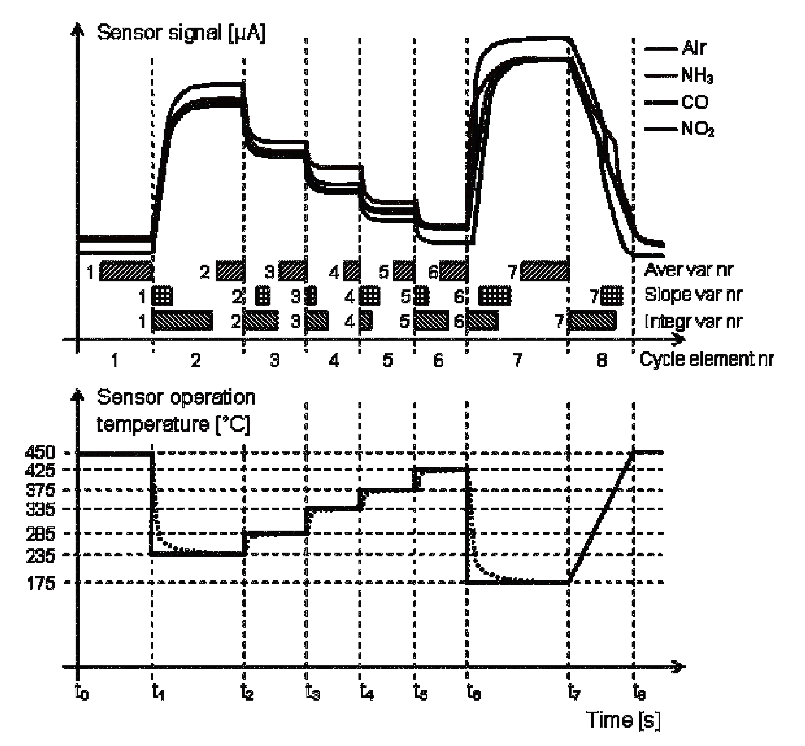
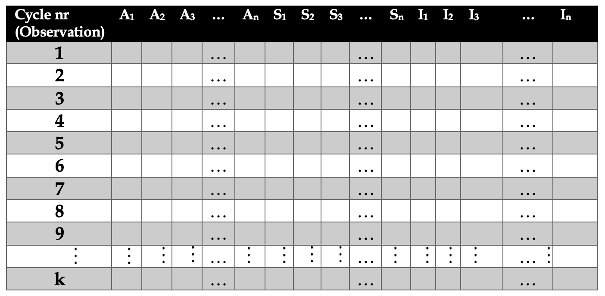

```{r setup, include=FALSE}
knitr::opts_chunk$set(echo = FALSE)
```

**732A64 - Master Thesis Project Description**

Marcos Freitas Mourão dos Santos - `marfr825` - marfr825@student.liu.se

### 1. Title

Improving the identification of nitrogen oxides and ammonia using frequency modulation in sensors via multivariate statistical analysis of sensor data.

### 2. Problem background (adapted from [1])

Increasing emissions and aggregation of atmospheric nitrogen oxides ($\text{NO}_x$) are detrimental to human/animal health and the climate. Human activity/man made processes are the main source of $\text{NO}_x$, chiefly combustion processes. Therefore, a reduction of its emissions is desired.

The most commonly used technology for reducing $\text{NO}_x$ emissions is Selective Catalytic Reduction (SCR) of $\text{NO}_x$ by ammonia ($\text{NH}_3$). For the correct amount of ammonia to be dosed into systems, two sensors measuring the concentration of nitrogen oxides are usually employed, one located upstream and the other downstream of the SCR catalyst.

However, two main issues still remain: for the currently employed sensor technology, it is not possible to measure $\text{NO}$ and $\text{NO}_2$ individually. Moreover, the sensor is also sensitive to ammonia and will give a similar response to ammonia as to $\text{NO}_x$.

Improvement in the ability to both individually measure the different nitrogen oxides and to clearly separate between nitrogen oxides and ammonia is desired. There are strong indications that an improvement in the individual measurement of gas species could be achieved by operating the sensor in the frequency domain (rather than the common static DC domain).

### 3. Aims

- Check influence of frequency modulation: can it be used to improve simultaneous identification of $\text{NO} / \text{NO}_2 / \text{NH}_3$?;
- Investigate/identify trends regarding the influence of frequency on identification of different gas species;
- Compare to previous work on simultaneous monitoring of $\text{NO}_x / \text{NH}_3$;
- Investigate a few conceptually different classification methods on gas species separation;
- Try to estimate the effects of the work on reduction of emission in real applications.

### 4. Data description

Measurements will consist of continuous sensor data: gas concentrations and sensor responses (i.e. current and voltage). The experiments will be run in constant temperature.

Initial data will be gathered in the beginning of January with possibility of additional data for evaluation purposes be supplied during the thesis work. The data that will be acquired will be similar to data from previous experiments. These experiments, however, were made with temperature cycling, instead of frequency modulation. Nonetheless, it is expected  that the data will be of similar structure.

Figure 1 shows typical sensor response when submitted to temperature cycles. In addition of directly measured variables (i.e. temperature, sensor current), it is also possible to derive additional features such as average, slope and integral variables of the sensor response for each cycle. Additionally, Figure 2 shows what a typical dataset of these experiments would look like. For each cycle, all direct and indirect features are recorded in a table. **Note**: Figures were adapted from [2].

```{r,fig.cap='Typical sensor signal for different gasses during temperature cycling.',fig.align="center",out.width = "300px"}

```


```{r,fig.cap='Typical data structure for temperature cycles.',fig.align="center",out.width = "350px"}

```

### 5. Contacts

- Mike Andersson - mike.andersson@liu.se
- Annika Tillander - annika.tillander@liu.se

### 6. References

[1] Andersson, M. (2020). _Overview description of a master thesis project proposal on multivariate statistical data evaluation for the improvement of $\text{NO}_x/ \text{NH}_3$ sensors._ Personal communication. December $1^{st}$ 2020.

[2] Andersson, M. (2020). _Overview on sensor signal processing and multivariate sensor data structure_. Personal communication. December 16 2020.


